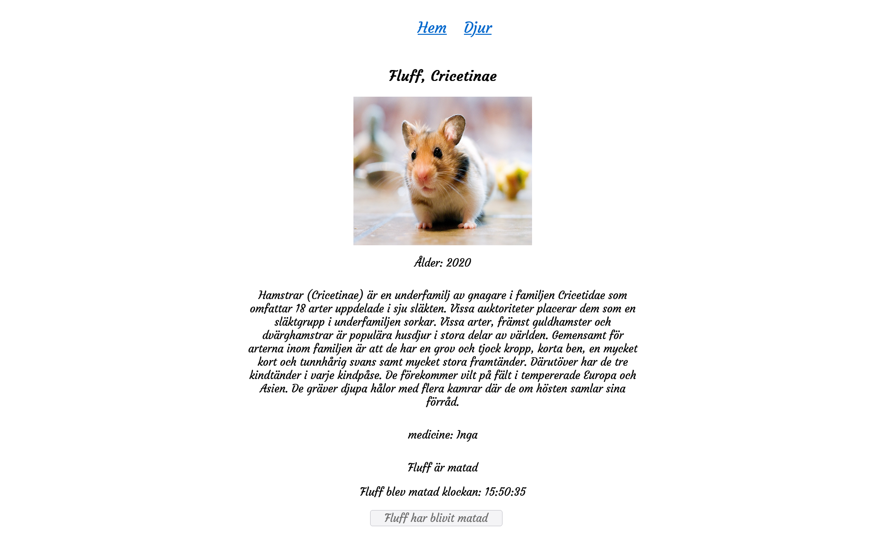

## Table of contents

- [Overview](#overview)
  - [react-zoo](#react-zoo)
  - [Project setup](#project-setup)
  - [Built with](#built-with)
  - [Screenshot](#screenshot)
  - [Author](#author)

## Overview

### react-zoo

Live Project - https://rasweb.github.io/React-Zoo-Assignment/

Welcome to my React Zoo assignment. This was created upon the request of Medieinstitutet Stockholm, Sweden.
The requirements for this assignment is to work with React typescript and can be found in this file .
The instructions and all of the textual data on this site are in swedish. But the code is mostly in english.

Fulfilled requirements:

- Create a Single Page Application(SPA)
- Present the animals
- Show more info about specific animal in route
- Boolean to mark if animal has been fed.
- Disabled button when animals has been fed.
- Implement the time the animal was fed.

## Project setup

To see this project in the browser find this file 
If route dosen't work

```
<HashRouter> to <BrowserRouter>
```

Install packages

```
npm install
```

### Compiles and hot-reloads for development

```
npm start
```

### Built with

- React
- React router
- JavaScript
- TypeScript
- html
- styled-components(css/scss)

### Screenshot



### Author

[Github](https://github.com/Rasweb)
